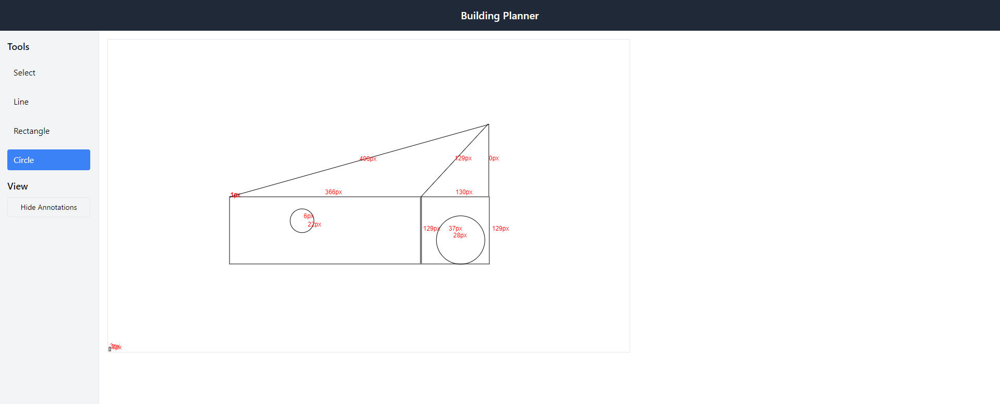

# 🏗️ Building Planner - L2 Assignment

This is a web-based building planner tool built using **React** and **Tailwind CSS**. It allows users to draw basic shapes like lines, rectangles, and circles on a canvas. Users can annotate shapes with dimensions, select and move them using a select tool, and toggle annotation visibility.

---

## 🚀 Features

- ✏️ **Draw Tools**: Line, Rectangle, Circle
- 🖱️ **Select Tool**: Click to select, drag to move shapes
- 📏 **Annotations**: Length, width, radius (toggle on/off)
- 🗑️ Delete shapes using `Delete` or `Backspace` key when selected
- 💡 Clean and minimal interface
- 🎯 Responsive and easy to use

---

## 📸 Screenshots

> Add your own screenshots in the `screenshots/` folder and link them here:

| Draw Tools | Select Tool | Annotation Toggle |
| ---------- | ----------- | ----------------- |

| 

---

## 🧰 Tech Stack

- [React](https://reactjs.org/)
- [Tailwind CSS](https://tailwindcss.com/)
- [Vite](https://vitejs.dev/) (for fast builds)

---

## 🛠️ Setup & Run Locally

```bash
# 1. Clone the repository
git clone https://github.com/your-username/building-planner.git
cd building-planner

# 2. Install dependencies
npm install

# 3. Start the development server
npm run dev

# 4. Open in browser
# Visit http://localhost:5173


## Project Structure
src/
├── components/
│   ├── DrawingCanvas.jsx
│   └── Toolbar.jsx
├── App.jsx
├── main.jsx
└── index.css
```
